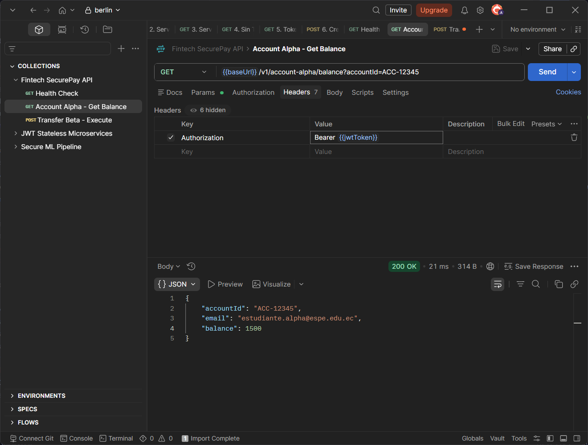
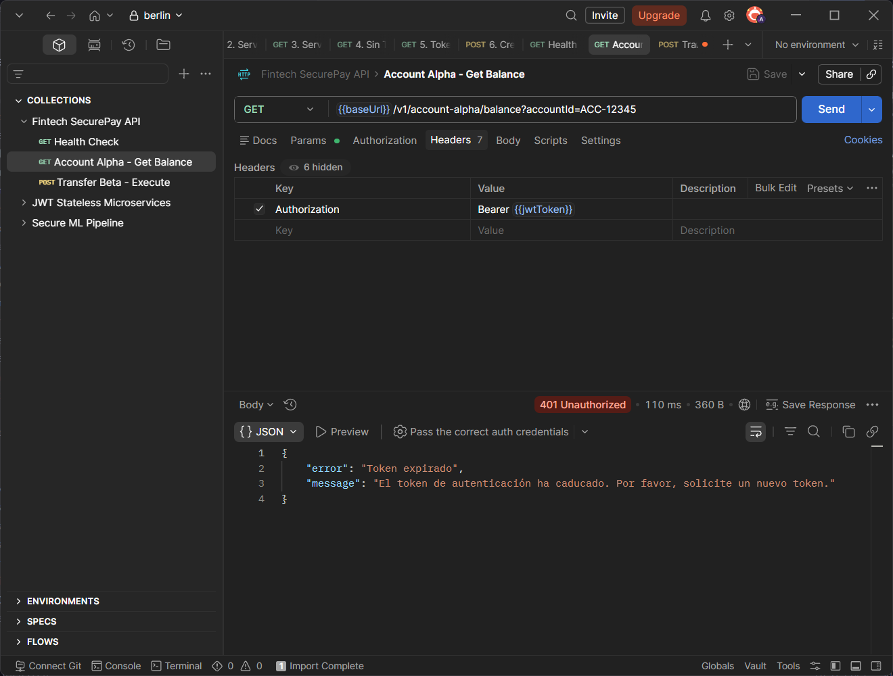
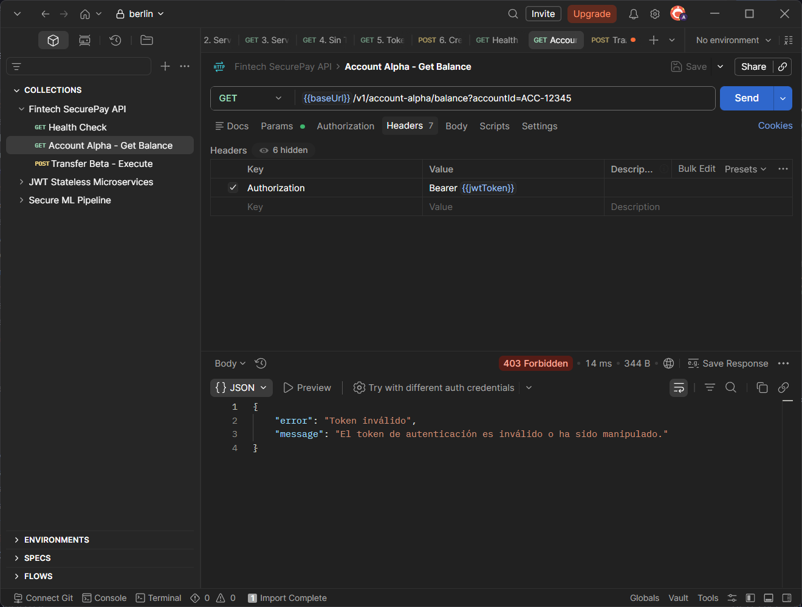
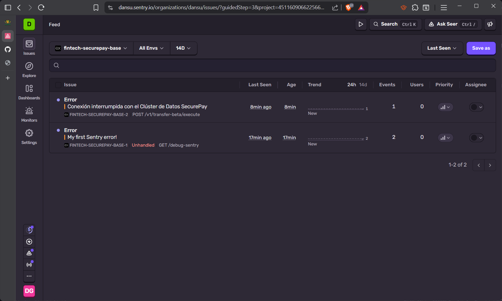
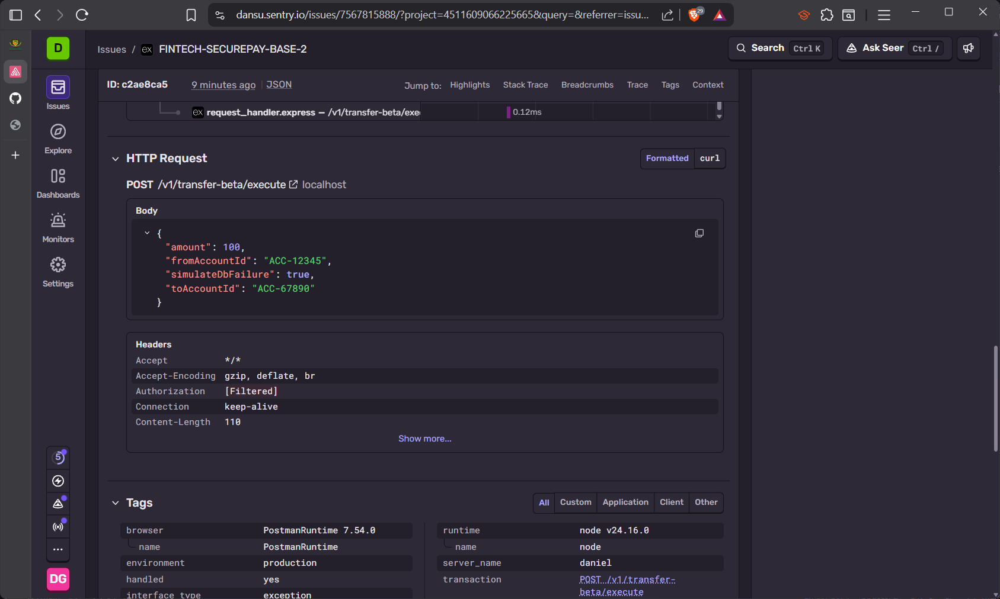

# Fintech SecurePay — Bitácora de Evaluación

UNIVERSIDAD DE LAS FUERZAS ARMADAS ESPE

Nombre: Daniel Guaman

Aplicaciones Distribuidas - NRC 30732

Proyecto base para evaluaciones de aplicaciones distribuidas (ESPE).

---

## 1. Refactorización SOLID (SRP + DIP)

Rama: `feature/01-refactor-solid`

- Se descompuso `transaction.monolith.service.js` en servicios de bajo nivel independientes:
  - `FinancialVerificationService` — validaciones de negocio.
  - `StateStorageService` — persistencia en memoria.
  - `ConsoleNotificationService` — notificaciones por consola.
- `TransactionService` recibe dependencias por constructor (DIP).
- `container.js` centraliza la composición manual (Pure DI).

---

## 2. Seguridad & Autenticación Asimétrica Stateless

Rama: `feature/02-auth-jwt`

- Generación de claves RSA (PKCS#8): `private.pem` y `public.pem`.
- `jwt.service.js`: firma asimétrica **RS256** con claims `sub`, `name` y expiración de **2 minutos**.
- `auth.middleware.js`: validación autónoma con llave pública.

### 2.1 Generación de Token JWT

```bash
node -e "const jwt = require('./src/services/jwt.service'); console.log(jwt.signToken({id:'usr_002', name:'Docente Beta'}));"
```


### 2.2 Postman — Acceso Válido (200)

Request a `GET /v1/account-alpha/balance?accountId=ACC-12345` con **Bearer Token válido**.





### 2.3 Postman — Token Expirado (401)

Request con un **token expirado** 



### 2.4 Postman — Token Malformado / Inválido (403)

Request con un **token inválido** 



---

## 3. Observabilidad & Gestión de Excepciones

Rama: `feature/03-observabilidad`

- `src/instrument.js`: inicialización del SDK de Sentry.
- `index.js`: `setupExpressErrorHandler(app)` después de todos los controllers.
- Separación estricta:
  - **Errores Lógicos (401/403)**: capturados en `auth.middleware.js`, **NO** alertan a Sentry.
  - **Errores Operacionales (500)**: alertan a Sentry con tags personalizados.

### 3.1 Disparador de Error Operacional 500

Endpoint: `POST /v1/transfer-beta/execute`

Body:
```json
{
  "fromAccountId": "ACC-12345",
  "toAccountId": "ACC-67890",
  "amount": 100,
  "simulateDbFailure": true
}
```


### 3.2 Panel de Sentry — Error Operacional



### 3.3 Panel de Sentry — Tags de Usuario



---

## Instrucciones para ejecutar

```bash
# Instalar dependencias
npm install

# Generar token para pruebas
node -e "const jwt = require('./src/services/jwt.service'); console.log(jwt.signToken({id:'usr_001', name:'Estudiante Alpha'}));"

# Iniciar servidor
npm start
```

---

## Estructura de Ramas

| Rama | Propósito |
|---|---|
| `main` | Código integrado |
| `feature/01-refactor-solid` | Separación de responsabilidades e inyección de dependencias |
| `feature/02-auth-jwt` | Firmado RS256 y middleware de autenticación |
| `feature/03-observabilidad` | Sentry, errores lógicos vs. operacionales |
